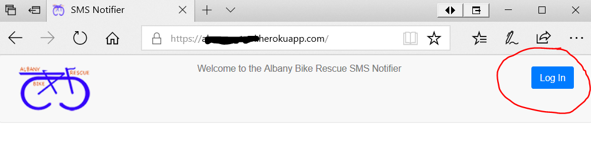

# sms-notifier

This project provides a gui to allow organizations such as non profits to manage a membership list and to send text messages to that list.  Once set up administrators can send text messages to their organization simply by sending a message to the organization's administration number.

The application is a node express server with a react front end.

## Configuring the server

The server relies on three external services that must be set up and configured before it will work. 
  1) **Tropo cPaaS** (Communication Platform as a Service).   
  This service provides the phone numbers and does the actual text messaging.   Prior to running the application, a Tropo account should be created at www.tropo.com.  Add a payment method, and contact support to have outbound privileges enabled.
  Once an account is available a Tropo WebAPI application must be setup and phone numbers must be configured to use our application.   This step is automated with the <a href='./scripts/setup-tropo.js'> setup-tropo.js</a> script.  Run the script as follows in a command shell from the project directory:

    npm install
    cd scripts
    node setup-tropo.js -u [Tropo user name] -p [Tropo password] -n [User supplied name for the new webAPI application being created] -u [URL where this application will be deployed ] -a [3 digit area code for the two numbers that will be leased for this application]

 After Tropo is setup the following environment variables need to be set.  The script provides the correct values
<ul>
<li>TROPO_API_KEY -- Token used by our app to request services from Tropo
<li>TROPO_PUBLIC_NUMBER -- The number that will send messages to members of our organization
<li>TROPO_ADMIN_NUMBER -- The number that admins will see member responses on.  Admins can also text this number to broadcast to all members.
</ul>
Note that all Tropo code is localized to <a href='./tropo-connector.js'>tropo-connector.js</a>.   It should be possible to create a new module to use a different cPaaS. 

 2) **MongoDB Altas** provides the cloud storage of the membership list.  A free or paid account must be setup at https://www.mongodb.com/cloud/atlas.  
 Once configured the following environment variables need to be set:
<ul>
<li>MONGO_DB = The name of the database set up in the configuration phase
<li>MONGO_DB_COLLECTION = The name of the collection set up in the configuration phase
<li>MONGO_URL -- the connection string to the database collection that was setup during the configuration phase
<li>MONGO_DB_USER
<li>MONGO_DB_PASSWORD
</ul>
Note that all mongo code is localized to <a href='./member-list.js'>member-list.js</a>.   It should be possible to create a new module to use a different database. 

 
3) **Auth0** provides the identity and authorization service.   When users navigate to our web page they are redirected to Auth0 to sign in.   Upon successful login Auth0 provides a JWT token which is used to validate calls to the server.   A free or paid account must be set up at https://auth0.com/, as follows:
  
[] On auth0.com, create a Single Page Web Application client.   
[] In the Quick Start, specify React as the web app technology.   On the settings tab populate the Allowed Callback URLs.  Typically this will include http://localhost:3000/callback when initially building your app and you will need to add additional info such as the the URL where your server is running when not in debug mode, ie:

    https://localhost:1185/callback, https://some-app-name.herokuapp.com/callback   

[]Save the client Settings  

Once the client is setup, we need to set up the API that our server provides, so that when clients log into our web app, the Auth0 client will provide them with a JWT that will allow the react app to call the APIs in our server. This process is described here: https://auth0.com/docs/apis#how-to-configure-an-api-in-auth0  
Briefly, in Auth0 click on the APIs menu on the left and click the "Create API" button in the upper right hand corner.  The new API needs a name and an Identifier.   This Identifier will be used to set the REACT_APP_OAUTH_AUDIENCE environment variable in the next step.   Accept the default RS256 signing algorithm.

Once configured the following environment variables need to be set:
<ul>
<li>REACT_APP_OAUTH_DOMAIN -- domain name setup in the configuration step
<li>REACT_APP_OAUTH_AUDIENCE -- audience name setup in the configuration step
<li>REACT_APP_OAUTH_CALLBACK -- provided by Auth0 during the setup
<li>REACT_APP_OAUTH_CLIENT_ID -- provided by Auth0 during the setup
</ul>
All four of these environment variables are used by the react client code.  The REACT_APP_OAUTH_DOMAIN and the REACT_APP_OAUTH_AUDIENCE are also used by the server.  If you use the dotenv library to set environment variables make sure to set these in both the project root and the client subdirectory.

Note that all auth0 code is localized to <a href='./client/src/auth.js'>auth.js</a>.   It should be possible to create a new module to use a identity provider. 

Prior to running the application, the Auth0 owner needs to set up at least one user in the Auth0 system so that they can
login to the sms-notifier app.

## Branding the Application
In addition to the configuration steps above, developers should do the following to brand the website and text messages for their organization, as follows:

1)  Update logo.png to a logo for your organization.   Ideally the logo height is not greater than 75 pixels.  Logo width can be up to 128 pixels.
2)  Update favicon.ico in the clients/public directory to match your organizations log

Set the following environment variables:
<ul>
<li>REACT_APP_ORGANIZATION_NAME -- this is the name that appears on the website, and in all branded text messages sent from the system.   If you are using .env files in development, this variable is used by both the client and the server so you'll need to set it in both places.
<li>REACT_APP_ORGANIZATION_NAME -- the url that web users are redirected to if they click the logo image.   This is used only by the client.
</ul>

## Running the client in dev mode

The react client was built using the <a href='https://github.com/facebookincubator/create-react-app'>create-react-app</a> package.   During development it runs on localhost:3000, by running

    npm start

in the client directory.   Run:

    npm run build

in the client directory to build the packaged client which can be used when running the server in standalone mode.

## Running the server
The server is a standard node express server that can be started by typing:

    npm start

You can tell your server running locally to serve your optimized build by setting the environment variable DEV_MODE to 'production'.

Note that the URL where the server runs is needed during the Tropo configuration phase, so that a Tropo WebAPI app can be configured to call into our server to process requests.   Typically developers will initially run the setup-tropo.js script twice, first for their development application and then once they are ready to deploy, they will run the script again to create a new Tropo WebAPI application that points to their production instance of this application.  

## Testing the server

This package comes with postman collection to exercise the APIs called by the web client and to emulate incoming texts to the public and admin numbers.   The collection can be loaded into Postman and run using the Postman Runner, or if Postman's newman tool is installed they can be run from the command line by typing:

    npm test

The Postman scripts require the the following environment variables to be set:
<ul>
<li>url -- url where the sms-notifier server is running (ie: localhost:1185)
<li>sms_recipient -- phone number of a tester to get SMS messages sent from the test run.  Ideally this will be the number of an active member in the system under test.
<li>public_number -- the public number of the system under test (same as TROPO_PUBLIC_NUMBER)
<li>admin_number -- the admin number of the system under test (same as TROPO_ADMIN_NUMBER)
<li>org_name -- The name of the organization the system is set up for.
<li>auth_domain -- The domain set up in Auth0.   This is available in the Clients/Setting menu at manage.auth0.com
<li>auth_client_id -- The client id for the non-interactive Test Client that is automatically created when you set up a single page applciation client in Auth0.   This is available in the Clients/Setting menu at manage.auth0.com
<li>auth_client_secret -- The client secret set up or the non-interactive Test Client in Auth0.   This is available in the Clients/Setting menu at manage.auth0.com. Click the checkbox to "Reveal Client Secret"
<li>auth_audience -- The API Audience set up in Auth0.  This is avialble in the APIs menu of at manage.auth0.com
</ul>

A stub postman-environment.json is included with this project.  Simply replace all the "[POPULATE ME]" sections as described above

## Creating User Accounts for the website

Access to the website is authorized via the Auth0 service.  Auth0 provides a variety of ways for users to authenticate includinghttps://manage.auth0.com/#/users the ability to integrate to other SSO systems or social media accounts like Facebook and Twitter.

It is also possible to create user directly via the [Auth0 dashboard](https://manage.auth0.com/#/users).  In this case the Auth0 system user must send the email/password combination, along with the URL to the website to the web user.   When using Auth0's user database, there is no way for end users to reset their password, an Auth0 system user must do this for them.

## Using the website

Web Users are typically invited to use the system when they receive an email from an Auth0 system user with their username and password.  The first time a user navigates to the application, they will see a screen that looks something like this:

Click the "Log In" button in the upper right hand corner and enter the username and password that were supplied to you.

After successful login, the web user is provided with a form to send SMS and a table to manage members.  

 Web users can add new members to the list by selecting the New Button  

After selecting the New Member button, web users can add the phone number, name and email of any members they want to add to the list.   

Check the Admin checkbox in the lower right hand corner if this new user will be an "Administrator".   Admins have the ability to send messages to all members directly from their phones and to respond individually to members via text (see "Using the service via text messages" section below).   Note that Admins are not necessarily the same as Web Users.   A Web User can configure Admins who have the ability to send text alerts to all members, but these members will not have the ability to log into the web page and manage the membership list unless they have an account setup by an Administrator.

Web Console users can also Delete members from the list by choosing the Delete Member button.

Each member who has a checkmark next to their name will receive any text messages sent from the web application.  By default all members who have not opted out will be checked.  Web Application users can check/uncheck users to override this behavior and create custom recipient lists.

Selecting the checkbox on the column header will select/unselect all rows.

For organizations that have many members it is sometimes convenient to sort by a particular column (for example to see which members have Admin privileges).   Clicking on the column header will sort the rows by that column. Clicking the same header a second time will reverse the ordering.  For example in this image, the user has clicked on the Admin" column header to have members where the Admin column is true at the top of the list:

The other columns in this screenshot:
* OptOut - members who have chosen to opt out of Text Notifications
* #Sent - the number of messages sent to this member
* #Failed - the number of messages sent that were not confirmed as received

Are also commonly sorted.

On systems that have many members it can sometimes be useful to see a list of ONLY the members whose rows are checked.   The "Show Selected Only" button will filter out any rows that are not checked.

Once the web user is happy with the recipient list, they can use the Text Entry box at the top of the page, to compose a message.   The text above the text entry box will be sent at the beginning of every message and the text at the bottom of the box will be sent at the end of every message.  For example, if a web user enters the following:

The text message that is sent to all members with checked rows will be:

    Message from Albany Bike Rescue:
    Super important meeting on Tuesday.   Please join us as we are having cake!
    Reply Stop to opt out.

Text Messages must be shorter than 140 characters.   If the composed message, along with the non-editable intro and outro text exceeds 140 characters the user will see a warning:

As the warning indicates, messages that are too long will be split into two or more messages.

When the Web User is happy with the message text, hitting the "Send It" button will send the message to all users whose with selected rows.

After sending a message, the Web User can hit the Refresh Sent/Failed Counts button.   Clicking on the #Failed column header will sort on this column.  Rows that have a non zero entry in this field indicate members that did not get a text message sent from this system.   This generally indicates that the phone number is a land line or otherwise cannot except text messages.

If the Web User determines that part of a member entry is incorrect, clicking on the Phone, First Name, Last Name or Email fields will allow the user to edit the entry in that field.  The entry is updated when the user clicks outside of the edit box.   The editing is ignored if the web user hits the escape key.

## Using the service via text messages

Once the member list is set up, Admins have the ability to manage communications without using the web console simply by sending texts to the TROPO_ADMIN_NUMBER.   By default this will "broadcast" that message to all members who have not opted out.  Recipients of these messages will see the "From Number" for this message as the TROPO_PUBLIC_NUMBER.  This ensures that members will not have the personal phone numbers of any Administrators.

When members (or anyone really) send a text to the TROPO_PUBLIC_NUMBER, that message is forwarded to all the Admins, who can use the "Reply" functionality to answer that member directly.  To reply to one person the Admin should type the following:

    Reply [number] [message]

When the "Reply" command is used only the user with the [number] will receive the [message].   All other Admins will also be copied so that they can see that the message was responded to.

If anyone other than an Administrator sends a text to the TROPO_ADMIN_NUMBER they receive a response saying that this is not allowed and to contact the staff at the organization.

## TO-DO:

See <a href='./todo.txt'>todo.txt</a>
